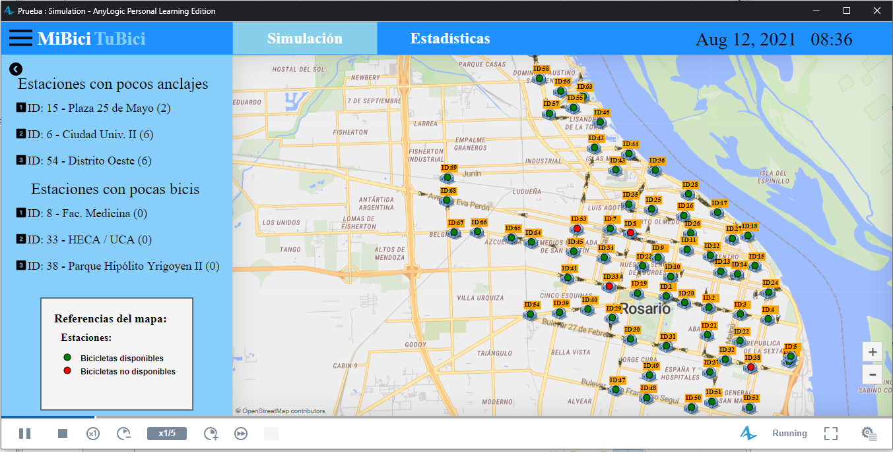
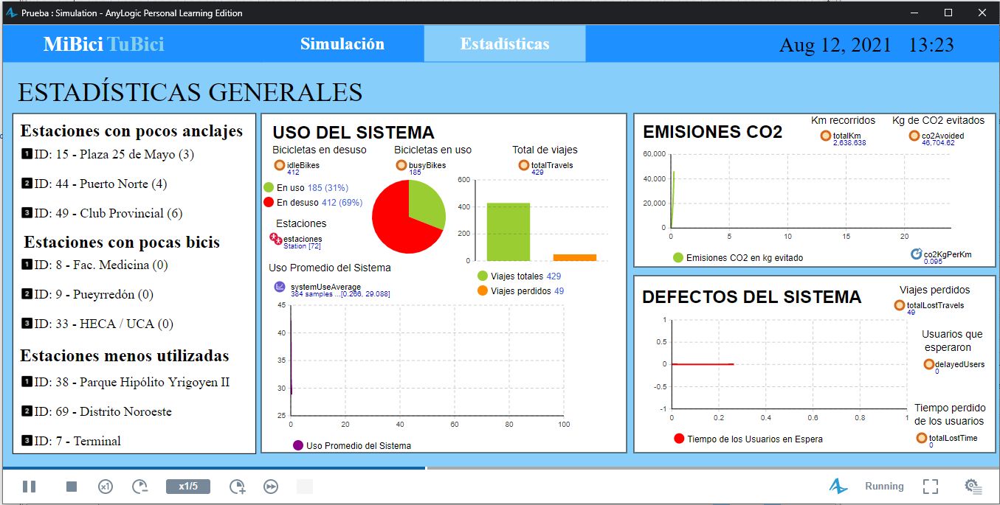

## Simulación sobre la expansión del sistema de bicicletas públicas de la ciudad de Rosario

Este repositorio fue parte del trabajo final de la materia Simulación en la Universidad Tecnológica Nacional, Facultad Regional Rosario.

El video presentación del trabajo se encuentra disponible en .
El documento final se encuentra disponible .

### Descripción
En este trabajo, se evaluaron alternativas de expansión del sistema de bicicletas públicas _Mi Bici Tu Bici_ de la ciudad de Rosario en las estaciones céntricas. Se consideraron dos alternativas:
1. Instalar una nueva estación en una zona que no posee estaciones cercanas
2. Ampliar la capacidad de las estaciones que rodean a dicha zona.

En la carpeta '''Modelo''' está contenido el archivo '''MiBiciTuBici.alp'''' que contiene el modelo listo para ser ejecutado en el . Dentro del mismo directorio se encuentra el script '''query_system_state.py''' que actualiza la base de datos del modelo con las condiciones actuales y poder así ejecutar la simulación con el mínimo estado transitorio posible.

El modelo se desarrolló en la versión Anylogic PLE 8.7 y no fué probado en versiones anteriores.

### Screenshots

